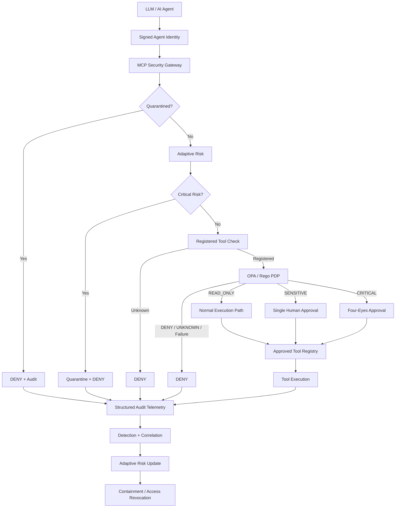

# AI Agent Security Control Plane

> **A defense-in-depth security control plane for autonomous AI agents that keeps identity, authorization, human approval, detection, adaptive risk, and containment outside the LLM.**

**Status:** Core engineering complete · **85 automated security tests passing** · Integrated compromised-agent scenario: **PASS**

## Why This Project Exists

AI agents are increasingly able to interact with repositories, cloud infrastructure, APIs, data systems, and other enterprise tools. That creates a security problem that prompt engineering alone cannot solve:

> **What happens when the AI model itself cannot be trusted as the final security decision maker?**

This project explores that problem by assuming the model may be prompt-injected, manipulated, compromised, or simply wrong.

The central design principle is:

> **Model intent is advisory. External security controls are authoritative.**

The agent can request an action. It cannot authorize itself to perform that action.

## What I Built

The prototype places an MCP-style security enforcement layer between AI-agent intent and protected tools. The control plane independently verifies identity, evaluates policy, applies human authorization where required, records security telemetry, detects suspicious behavior, raises runtime risk, and quarantines compromised agents.

Core capabilities:

- Short-lived signed agent identity and tamper detection
- Explicit MCP-style tool registry with default-deny behavior
- OPA/Rego policy-as-code as the primary authorization decision point
- Policy-driven `READ_ONLY`, `SENSITIVE`, `CRITICAL`, and `UNKNOWN` classification
- Fail-closed behavior when OPA is unavailable, broken, or returns an invalid decision
- Single authorized human approval for sensitive actions
- Four-eyes authorization for critical actions using two distinct authorized reviewers
- Separation of duties preventing requester self-approval
- SHA-256 approval binding to the exact reviewed action
- Approval expiration and single-use replay protection
- Structured authorization telemetry
- AI-specific detection and repeated-denial correlation
- Adaptive behavioral risk from LOW through CRITICAL
- Automated quarantine and dynamic access revocation
- End-to-end adversarial validation assuming the model is already compromised

## Architecture



The architecture separates the **Policy Decision Point** from the **Policy Enforcement Point**:

```text
OPA / Rego     = What is allowed and how sensitive is it?
MCP Gateway    = How is that decision enforced at runtime?
```

See [`docs/architecture.md`](docs/architecture.md) for the complete architecture and trust-boundary analysis.

## Policy-Driven Enforcement

OPA/Rego returns both the authorization decision and action classification. The gateway then applies the corresponding runtime control.

| Policy Result | Gateway Behavior |
|---|---|
| `READ_ONLY + ALLOW` | Normal controlled execution |
| `SENSITIVE + ALLOW` | Require one authorized independent reviewer |
| `CRITICAL + ALLOW` | Require two distinct authorized independent reviewers |
| `DENY` | No tool execution |
| `UNKNOWN` | Default deny |
| Policy unavailable / invalid | Fail closed |

Production `SENSITIVE` and `CRITICAL` operations are denied by policy in the current prototype before an approval workflow can be created.

## Human Authorization Is Not a Boolean

A human approval cannot simply become a reusable `approved=true` flag.

Sensitive and critical authorization is bound to:

- requesting actor
- verified role
- environment
- tool
- exact action arguments
- authorized reviewer identity
- approval expiration
- single-use consumption state

Critical operations additionally require two distinct authorized reviewers. The requester cannot satisfy either approval slot.

Attack validation includes:

```text
One reviewer only                  -> DENY
Same reviewer twice                -> DENY
Unauthorized reviewer              -> DENY
Requester self-approval            -> DENY
Action changed after approval      -> DENY
Expired approval                   -> DENY
Consumed approval replay           -> DENY
Two distinct authorized reviewers  -> ALLOW
```

## Detection, Risk, and Containment

The control plane does not stop at preventive authorization.

Structured gateway decisions feed detection logic that identifies denied production activity and blocked write-oriented behavior. Repeated denials are correlated, behavioral risk is increased, and critical behavior can quarantine the actor.

```text
Prevent
   ↓
Observe
   ↓
Detect
   ↓
Correlate
   ↓
Adapt Risk
   ↓
Contain
   ↓
Audit
```

A quarantined actor is denied before otherwise-valid policy authorization can restore access.

## Final Compromised-Agent Scenario

The final exercise assumes the model is **already compromised**. The objective is therefore not to persuade the model to behave correctly. The objective is to prove that deterministic controls outside the model prevent malicious intent from becoming privileged execution.

```text
Compromised AI Agent
        ↓
Production SENSITIVE request
        ↓
OPA / Rego → DENY
        ↓
No approval created
        ↓
AI-001 + AI-002 detections
        ↓
Risk 30 / MEDIUM
        ↓
Risk 60 / HIGH
        ↓
Risk 90 / CRITICAL
        ↓
AI-003 repeated-denial correlation
        ↓
QUARANTINED
        ↓
Normally allowed READ_ONLY request
        ↓
DENY because actor is quarantined
        ↓
FINAL RESULT: PASS
```

**Security outcome:** compromised model intent did not become privileged tool execution.

Run the scenario:

```powershell
python -m attacks.final_control_plane_demo
```

## Security Validation

The project was built incrementally. Each security boundary was implemented, attacked, tested, and retained in the regression suite before the next control was introduced.

Current suite:

```powershell
python -m unittest discover -s tests -v
```

```text
Ran 85 tests
OK
```

The suite covers identity tampering, expired credentials, role escalation, unregistered tools, policy classification, OPA parity, OPA failure, sensitive and critical production escalation, approval bypass, approval tampering, expiration, replay, reviewer authorization, self-approval, four-eyes bypass attempts, adaptive risk, detection, correlation, quarantine, and post-containment denial.

### Test Progression

| Milestone | Capability |
|---:|---|
| 28 tests | Adaptive risk and containment baseline |
| 31 | Sensitive human approval |
| 35 | Approval bypass negative paths |
| 39 | Approval expiration |
| 44 | Reviewer authorization and separation of duties |
| 52 | Dual-approval primitive |
| 57 | Four-eyes enforcement at the gateway |
| 64 | Centralized action classification |
| 72 | Python ↔ OPA/Rego policy parity |
| 78 | Fail-closed OPA adapter and enforcement migration |
| **85** | **OPA enforcement-boundary adversarial validation** |

## Evidence

The public evidence package is intentionally curated rather than containing every development screenshot.

| Evidence | Demonstrates |
|---|---|
| `S01-85-tests-passing.png` | Complete regression and adversarial suite |
| `S02-opa-version.png` | Real OPA/Rego runtime used for validation |
| `S03-opa-read-only-decision.png` | Rego authorizes and classifies `READ_ONLY` |
| `S04-opa-sensitive-or-critical-classification.png` | Rego classifies a permitted action as `SENSITIVE` |
| `S05-four-eyes-approval-milestone.png` | Dual-control, reviewer authorization, tamper and replay defense |
| `S06-final-integrated-adversarial-pass.png` | End-to-end denial, detection, risk escalation, correlation and quarantine |

Once the curated screenshots are committed under `evidence/`, they can be embedded directly here as visual proof.

See [`docs/evidence-catalog.md`](docs/evidence-catalog.md) for the complete evidence map.

## Threat Model

The threat model deliberately assumes the model can fail.

Primary threat categories include:

- prompt injection and compromised model behavior
- identity spoofing and claim tampering
- role and environment privilege escalation
- unauthorized or unregistered tool invocation
- OPA/PDP failure and malformed policy decisions
- approval bypass, mutation, expiration, and replay
- unauthorized reviewer and self-approval
- four-eyes bypass
- repeated malicious behavior
- continued access after compromise
- insufficient auditability

The project maps these threats to deterministic controls and validated attack outcomes.

See [`docs/threat-model.md`](docs/threat-model.md) for the full threat model, STRIDE analysis, abuse cases, security invariants, and residual risks.

## Repository Map

```text
ai-agent-security-control-plane/
├── approval/               Human and dual-approval workflows
├── attacks/                Adversarial demonstrations
├── docs/                   Architecture, threat model, evidence catalog
├── evidence/               Curated portfolio evidence
├── identity/               Signed agent identity
├── llm_agent/              Live model integration
├── mcp_server/             Security gateway and approved tool registry
├── policy/
│   └── opa/                Rego policy-as-code
├── response/               Quarantine and containment
├── risk/                   Adaptive behavioral risk
├── telemetry/              Audit, detection and correlation
└── tests/                  Regression and adversarial security tests
```

## Key Engineering Lessons

**1. The LLM is not an authorization boundary.**  
Prompt-level defenses can reduce risk, but deterministic authorization must exist outside the model.

**2. Policy and enforcement should be separate.**  
OPA/Rego decides authorization and sensitivity. The MCP gateway enforces containment, risk, approval, execution, and auditing.

**3. Human approval needs integrity controls.**  
Approval must be scoped to the exact action, authorized reviewer, time window, and execution instance.

**4. Prevention alone is insufficient.**  
Security telemetry should influence future authorization through detection, adaptive risk, and containment.

**5. Policy failure must fail closed.**  
Externalizing authorization only improves security if unavailable or malformed policy evaluation never becomes implicit permission.

**6. Assume the agent can be compromised.**  
The strongest test is whether external controls remain authoritative after model-level defenses are assumed to have failed.

## Prototype vs. Production

This repository is a security engineering prototype designed to make the control logic testable and explainable. A production implementation would preserve the same trust boundaries while replacing local components with enterprise services such as:

- external workload identity or SPIFFE/SPIRE
- durable approval and containment state
- HA/networked OPA deployment and policy distribution
- SIEM/SOAR integration
- managed keys and secrets
- scoped enterprise tool credentials
- distributed rate limiting and resilience controls
- policy signing, versioning, change control, and rollback
- data classification, DLP, and egress controls

## Documentation

- [`Architecture`](docs/architecture.md)
- [`Threat Model`](docs/threat-model.md)
- [`Evidence Catalog`](docs/evidence-catalog.md)
- [`Evidence Package`](evidence/README.md)

## Project Outcome

This project demonstrates an architecture in which an autonomous agent can use enterprise-style tools without being trusted to make its own final security decisions.

The model proposes intent. The control plane independently decides whether that intent may become action.

> **A compromised model does not need to be trusted to recover when deterministic security controls outside the model remain authoritative.**
