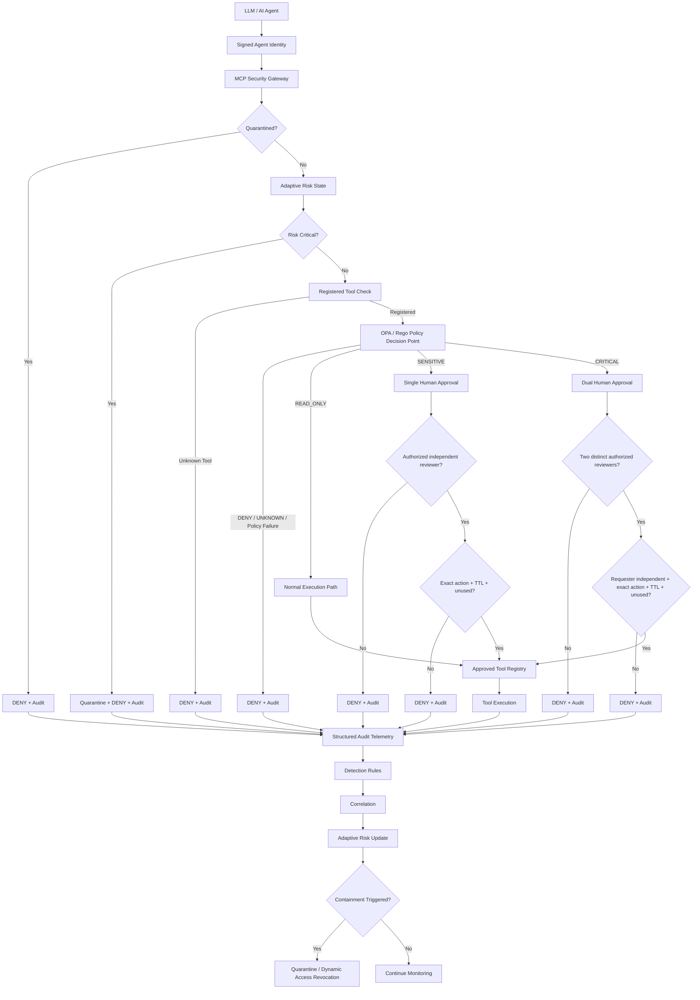
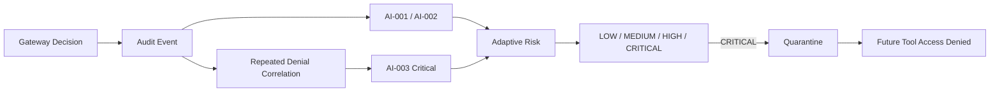

# AI Agent Security Control Plane Architecture

## Purpose

This document describes the final architecture of the AI Agent Security Control Plane prototype after the core engineering and adversarial validation phases were completed.

The design assumes that the LLM cannot be trusted as the final security decision maker. The model may request an action, but identity, authorization, approval, execution, telemetry, detection, risk, and containment are enforced by controls outside the model.

## Architectural Thesis

The central design principle is:

> Model intent is advisory. External security controls are authoritative.

A compromised or manipulated agent should not be able to convert model intent directly into privileged tool execution.

## High-Level Architecture



## Trust Boundaries

### 1. LLM to Identity Boundary

The model does not self-assert trusted identity. The prototype uses short-lived signed identity tokens containing actor and role claims. Signature validation and expiration checks occur outside the model.

Production equivalent: workload identity from a trusted identity provider, short-lived credentials, or technologies such as SPIFFE/SPIRE rather than a local shared signing secret.

### 2. Identity to Gateway Boundary

The MCP security gateway is the policy enforcement point. The agent cannot call a protected tool handler directly through the intended architecture. All tool requests must pass containment, risk, registration, policy, and approval controls.

### 3. Gateway to Policy Decision Point

OPA/Rego is the primary authorization policy decision point. Policy determines both whether the action is allowed and the action classification:

- `READ_ONLY`
- `SENSITIVE`
- `CRITICAL`
- `UNKNOWN`

The OPA adapter is fail closed. Unavailable, invalid, malformed, or broken policy evaluation produces `DENY`.

### 4. Gateway to Human Approval Boundary

Policy classification determines the approval workflow.

`SENSITIVE` actions require one authorized reviewer who is independent of the requester.

`CRITICAL` actions require two distinct authorized reviewers. The requester cannot serve as either reviewer.

Approvals are bound to the actor, role, environment, tool, and exact action arguments using a SHA-256 digest. They are time-bounded and single-use.

### 5. Gateway to Tool Execution Boundary

The tool registry is explicit. Unregistered tools fail closed before execution. The tool handler is reachable only after all required checks have succeeded.

### 6. Execution to Telemetry Boundary

Authorization decisions produce structured audit records containing:

- timestamp
- actor
- role
- environment
- tool name
- decision
- reason

This provides evidence for security operations and supports downstream detection and correlation.

### 7. Detection to Containment Boundary

Detection logic operates on audit events and can produce high-severity and critical findings. Repeated denied actions are correlated into `AI-003`, and containment can move the actor into `QUARANTINED` state.

Quarantine takes precedence over otherwise-valid policy authorization, dynamically revoking subsequent tool access.

## Policy Decision and Enforcement Separation

The architecture separates the policy decision point from the policy enforcement point.

```text
OPA / Rego = What is allowed and how sensitive is it?

MCP Gateway = How is that decision enforced at runtime?
```

OPA owns role/environment authorization and classification. The gateway owns:

- quarantine enforcement
- adaptive-risk restrictions
- tool registration
- approval orchestration
- tool dispatch
- audit event creation

This separation makes policy easier to modify and test without embedding security classification logic throughout the gateway.

## Authorization Matrix

| Action Class | Example | Development | Production | Human Control |
|---|---|---|---|---|
| READ_ONLY | `read_repository_summary` | Policy-controlled | Policy-controlled | None in current prototype |
| SENSITIVE | `create_issue_draft` | Allowed by policy, then approval required | Denied | One authorized independent reviewer |
| CRITICAL | `critical_configuration_change` | Allowed by policy, then dual approval required | Denied | Two distinct authorized independent reviewers |
| UNKNOWN | unclassified tool | Denied | Denied | Not applicable |

## Runtime Control Order

The gateway evaluates controls in an intentional order:

1. Quarantine state
2. Critical adaptive risk
3. Tool registration
4. OPA/Rego authorization
5. High-risk restriction for `SENSITIVE` and `CRITICAL`
6. Human approval workflow based on classification
7. Tool execution
8. Structured audit generation

This means a quarantined actor is denied before OPA is consulted, and an unregistered tool is denied before it can reach policy or a handler.

## Detection and Response Loop



The integrated adversarial demonstration validated the sequence:

```text
Repeated production SENSITIVE requests
→ OPA DENY
→ AI-001 + AI-002
→ Risk 30/MEDIUM
→ Risk 60/HIGH
→ Risk 90/CRITICAL
→ AI-003 correlation
→ QUARANTINE
→ Normally allowed READ_ONLY request
→ DENY
```

## Fail-Closed Properties

The architecture intentionally fails closed at multiple boundaries:

- invalid or expired identity token → deny
- unregistered tool → deny
- unknown role → deny
- unknown classification → deny
- production sensitive/critical action → deny
- OPA unavailable → deny
- broken Rego policy → deny
- invalid OPA response → deny
- missing approval → deny
- rejected approval → deny
- unauthorized reviewer → deny
- self approval → deny
- modified approved arguments → deny
- expired approval → deny
- replayed approval → deny
- one reviewer for critical action → deny
- same reviewer twice → deny
- quarantined actor → deny

## Prototype vs Production Architecture

This repository is intentionally a security engineering prototype. Several components are local or in-memory to keep the security logic explainable and testable.

For production, the same architecture would typically replace prototype components with:

- external workload identity instead of a local HMAC signing secret
- durable approval records instead of in-memory state
- a networked OPA service or policy distribution architecture
- durable risk and containment state
- SIEM/SOAR integration for audit and detection
- managed secrets and keys
- real enterprise tool connectors with scoped credentials
- HA, policy versioning, change control, and rollback

The security boundaries remain the same even when the implementation technology changes.

## Validated Engineering Milestones

The final core prototype includes:

- live LLM agent invocation
- MCP-style tool security gateway
- signed short-lived agent identity
- OPA/Rego authorization and action classification
- fail-closed policy adapter
- explicit tool registration
- adaptive behavioral risk
- structured audit telemetry
- AI-specific detection rules and correlation
- automated quarantine
- one-person approval for sensitive actions
- four-eyes approval for critical actions
- action binding, expiration, and replay prevention
- 85 passing automated regression and adversarial tests
- final integrated compromised-agent demonstration with `FINAL RESULT: PASS`

## Design Outcome

The final architecture demonstrates that a system does not need to trust a compromised LLM to recover or behave correctly. The security objective is achieved by keeping deterministic control over identity, authorization, approvals, tool execution, detection, and containment outside the model.